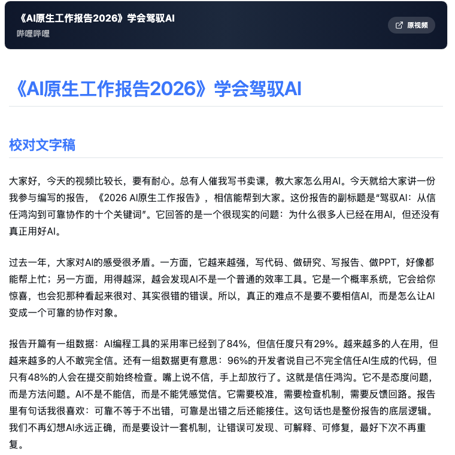
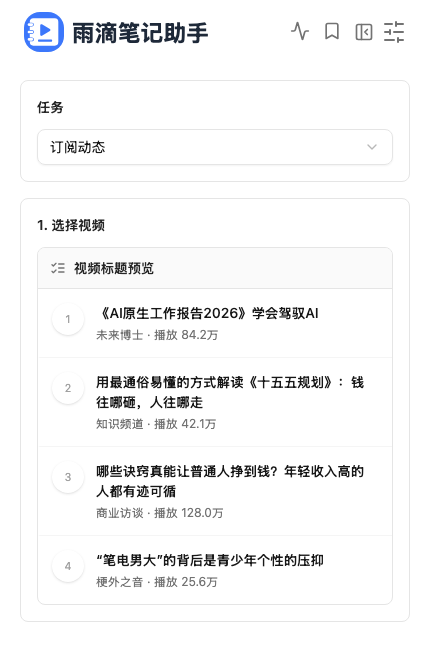

# 雨滴笔记助手

把你有权使用的哔哩哔哩视频、关注动态和本地音视频，整理成可阅读、可检索、可继续编辑的文字稿与 Markdown 笔记。

雨滴笔记助手以 **哔哩哔哩** 为主要使用场景，支持从单个视频、UP 主主页、订阅动态中选择内容；也提供 **YouTube** 单视频和频道内容的辅助支持。你可以用它下载授权视频、生成校对文字稿、沉淀结构化笔记，并在历史记录里继续回看、收藏和导出。

  

## 适合谁

- 经常看 B 站课程、访谈、公开课、长视频，想把内容沉淀成文字资料的人。
- 关注很多 UP 主，希望从订阅动态里快速挑选值得整理的视频的人。
- 需要把视频转成文字稿，再交给自己继续编辑、标注、复盘的人。
- 想先保存授权视频，再慢慢整理成笔记的人。
- 偶尔处理 YouTube 视频或频道内容，但主要工作流仍在 B 站的人。

## 主要功能

### 从 B 站内容开始

- 粘贴 B 站视频链接，生成校对后的中文文字稿。
- 输入 UP 主主页，预览近期视频后批量生成文字稿。
- 读取 B 站订阅动态，从关注内容里直接选择要处理的视频。
- 支持已经处理过的视频回看结果，避免重复整理。

<table>
  <tr>
    <td width="50%">
      
    </td>
    <td width="50%">
      
    </td>
  </tr>
  <tr>
    <td align="center">从订阅动态里选择视频</td>
    <td align="center">切换为视频下载并选择分辨率</td>
  </tr>
</table>

### 生成可继续整理的笔记

- 自动生成 Markdown 文字稿，便于复制、导出和二次编辑。
- 保留生成历史，支持搜索、收藏、重新生成和原文参照。
- 可在笔记中保留原片链接、截图和 AI 总结，方便回到视频上下文。
- 支持多种模型服务配置，可按自己的 API 和模型偏好调整。

### 下载授权视频

- 单视频模式可切换为“下载视频”。
- 可选择最佳、4K、1080P、720P、480P、360P 等分辨率。
- 下载和文字稿生成共用同一套任务历史，后续可以继续整理。

## 支持的平台

| 平台 | 当前定位 | 支持能力 |
| --- | --- | --- |
| 哔哩哔哩 | 主平台 | 单视频、UP 主主页、订阅动态、视频下载、字幕/音频转写 |
| YouTube | 辅助平台 | 单视频、频道主页、字幕优先的文字稿生成 |
| 本地文件 | 辅助来源 | 本地音视频转写与笔记生成 |
| 抖音、快手 | 兼容来源 | 保留已有适配能力，非当前主展示方向 |

## 工作流

1. 选择来源：单个视频、创作者主页、订阅动态或本地文件。
2. 选择任务：生成文字稿，或下载授权视频。
3. 等待处理：应用自动完成下载、字幕读取、音频转写和文字稿整理。
4. 查看结果：在历史记录中打开 Markdown 笔记，复制、导出、收藏或重新生成。
5. 继续沉淀：把文字稿放进自己的知识库、笔记软件或写作流程。

## 使用边界

请只处理你拥有权利、已经获得授权，或平台规则允许你用于个人学习和整理的内容。

请勿将本项目用于绕过访问控制、会员限制、付费限制或其他技术保护措施，也不要批量复制、传播未经授权的视频、音频、字幕、全文文字稿或衍生材料。生成结果可能包含识别错误或模型幻觉，正式引用前请自行核验。

## 当前状态

我们正在把项目从开发者可运行，推进到普通用户也能直接使用的桌面打包版本。README 现在优先展示产品能力；安装和运行说明会在打包版本稳定后补齐。

开发者仍可从源码运行：

- 后端：`backend/`，FastAPI，默认端口 `8483`。
- 前端：`BillNote_frontend/`，React + Vite，默认端口 `3015`。
- 桌面端：基于 Tauri，后续会整理为更顺手的发布产物。

## 技术栈

- 后端：FastAPI、SQLite、SQLAlchemy、yt-dlp、FFmpeg。
- 前端：React、Vite、TypeScript、Tailwind CSS、shadcn/ui。
- 桌面端：Tauri。
- 转写与模型：Fast-Whisper、MLX-Whisper、Groq、BCut，以及 OpenAI、DeepSeek、Qwen 等兼容模型服务。

## 项目来源

本项目由 [BiliNote](https://github.com/JefferyHcool/BiliNote) 改造而来，大幅改造了原有 AI 视频笔记能力，调整为更偏 B 站学习整理、订阅动态选择、授权视频下载和桌面端打包的使用体验。感谢原项目及社区贡献。

## 许可证

MIT License

## 鸣谢

感谢各个公益站的存在，让我能几乎无成本地 vibe coding 出一个自己会日常用的项目。

感谢 [DeepSeek](https://www.deepseek.com/)，如此低的 token 价格能让每篇文字稿的成本基本在一分钱以内。

感谢 [Linux Do](https://linux.do/)，让我学会了很多很多奇奇怪怪的知识，用上这么好用的 AI。
